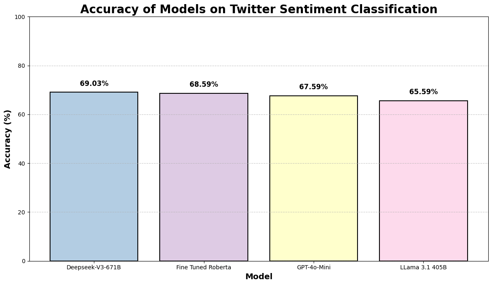

# Model Distillation with DeepSeek-V3 for Twitter Sentiment Analysis

## Project Overview
This project demonstrates knowledge distillation from DeepSeek-V3 (671B parameters) to a fine-tuned RoBERTa model (125M parameters) for Twitter sentiment analysis. We achieve comparable performance while reducing the model size by 99.97%.


## Table of Contents
- [Installation](#installation)
- [Project Structure](#project-structure)
- [Usage](#usage)
- [Model Performance](#model-performance)
- [Cost Analysis](#cost-analysis)
- [Acknowledgments](#acknowledgments)

## Installation
```
pip install langchain_fireworks
pip install datasets
pip install dotenv
pip install python-dotenv
pip install evaluate
```

## Project Structure
### 1. Data Preparation
- Dataset: [mteb/tweet_sentiment_extraction](https://huggingface.co/datasets/mteb/tweet_sentiment_extraction)
- Training set: 5000 samples
- Testing set: 1000 samples

### 2. Teacher Model
- DeepSeek-V3 671B via Fireworks.ai API
- Features:
  - Chain-of-Thought Reasoning
  - Few-shot Prompting
  - Sentiment Classification (positive, negative, neutral)

### 3. Student Model
- RoBERTa-base (125M parameters)
- Fine-tuned on teacher-generated annotations
- Published model: [keerthikumar517/roberta-deepseek-v3](https://huggingface.co/keerthikumar517/roberta-deepseek-v3)

## Usage
### 1. Environment Setup
```
# Load environment variables
from dotenv import load_dotenv
load_dotenv()
API_KEY = os.environ.get('FIREWORKS_API_KEY')
```

### 2. Teacher Model Implementation
```
from langchain_fireworks import ChatFireworks

deepseek_v3 = ChatFireworks(
    model="accounts/fireworks/models/deepseek-v3",
    temperature=0.7
)
```

### 3. Student Model Training
```
from transformers import (
    AutoTokenizer,
    AutoModelForSequenceClassification,
    TrainingArguments,
    Trainer
)

# Initialize model and tokenizer
tokenizer = AutoTokenizer.from_pretrained("roberta-base")
model = AutoModelForSequenceClassification.from_pretrained("roberta-base", num_labels=3)

# Training configuration
training_args = TrainingArguments(
    output_dir="./results2",
    learning_rate=5e-5,
    per_device_train_batch_size=16,
    num_train_epochs=5,
    weight_decay=0.01
)
```

### 4. Inference
```
from transformers import pipeline

classifier = pipeline("sentiment-analysis", 
                     model="keerthikumar517/roberta-deepseek-v3")

# Example usage
text = "Want to get a Blackberry but can't afford it."
result = classifier(text)
```
## Model Performance
### Accuracy Comparison
The following chart illustrates the accuracy of various models on Twitter sentiment classification:



- **DeepSeek-V3 671B**: 69.03%
- **Fine-Tuned RoBERTa**: 68.59%
- **GPT-4o-Mini**: 67.59%
- **Llama 3.1 405B**: 65.59%

### Summary
- All models performed well, with DeepSeek-V3 achieving the highest accuracy.
- The fine-tuned RoBERTa model closely followed, demonstrating effective distillation.


### Benefits
- Comparable accuracy to foundation model
- Significantly faster inference
- Reduced computational requirements
- Lower operational costs

## Cost Analysis
### API Costs
- DeepSeek-V3 API via Fireworks.ai:
  - Input (cache miss): $0.27 per million tokens
  - Input (cache hit): $0.07 per million tokens
  - Output: $1.10 per million tokens
- Total cost for 6,000 examples: ~$7

### Training Costs
- One-time training cost for RoBERTa model
- Significantly reduced inference costs post-training

## Acknowledgments
- Based on methodology from [Synthetic Data Save Costs](https://huggingface.co/blog/synthetic-data-save-costs) by Moritz Laurer
- Uses [Fireworks.ai](https://fireworks.ai/) for API access
- Inspired by [A Survey on Knowledge Distillation of Large Language Models](https://arxiv.org/pdf/2402.13116)

## License
MIT License

## Contact
For questions or feedback, please open an issue in this repository. 
